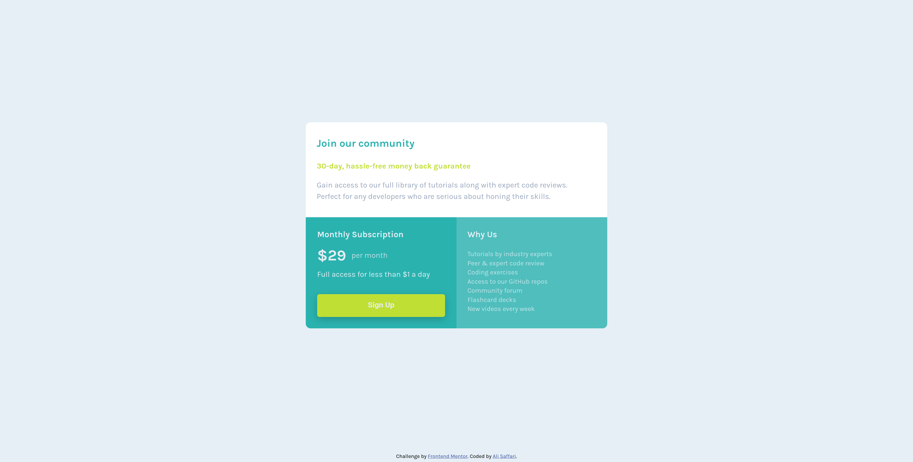

# Frontend Mentor - Single price grid component solution

This is a solution to the [Single price grid component challenge on Frontend Mentor](https://www.frontendmentor.io/challenges/single-price-grid-component-5ce41129d0ff452fec5abbbc). Frontend Mentor challenges help you improve your coding skills by building realistic projects. 

## Table of contents

- [Frontend Mentor - Single price grid component solution](#frontend-mentor---single-price-grid-component-solution)
  - [Table of contents](#table-of-contents)
  - [Overview](#overview)
    - [The challenge](#the-challenge)
    - [Screenshot](#screenshot)
    - [Links](#links)
  - [My process](#my-process)
    - [Built with](#built-with)
    - [What I learned](#what-i-learned)
  - [Author](#author)

## Overview

### The challenge

Users should be able to:

- View the optimal layout for the component depending on their device's screen size
- See a hover state on desktop for the Sign Up call-to-action

### Screenshot



### Links

- Solution URL: [Solution](https://www.frontendmentor.io/solutions/responsive-single-price-grid-component-solution-xdkWmm76zZ)
- Live Site URL: [Live site](https://single-price-grid-component-coral-three.vercel.app/)

## My process

### Built with

- Semantic HTML5 markup
- CSS custom properties
- Flexbox
- Mobile-first workflow

### What I learned

I learned about box-shadow css property and how to use it. Also I used media query for create a responsive exprience.

```css
.card_body > button {
    box-shadow: 0 5px 1rem 0.1px rgba(0,0,0,0.2);
}
```
```css
@media only screen and (min-width: 1440px) {
  .card {
    max-width: 634px;
  }
}
```

## Author

- Website - [Ali Saffari](https://github.com/alivsaffari/)
- Frontend Mentor - [@alivsaffari](https://www.frontendmentor.io/profile/alivsaffari)
- Twitter - [@alivsaffari](https://www.twitter.com/alivsaffari)
